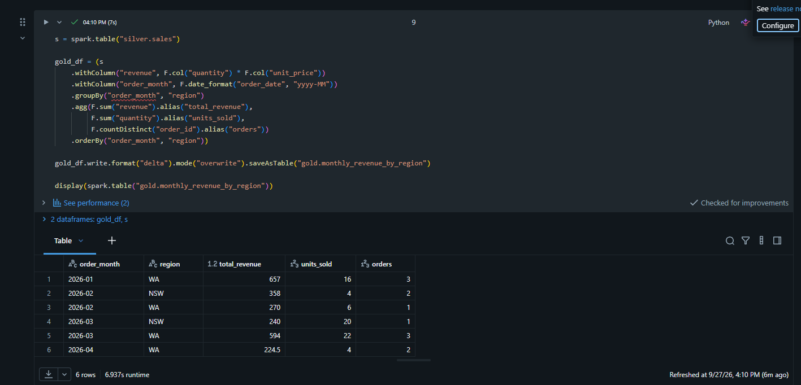
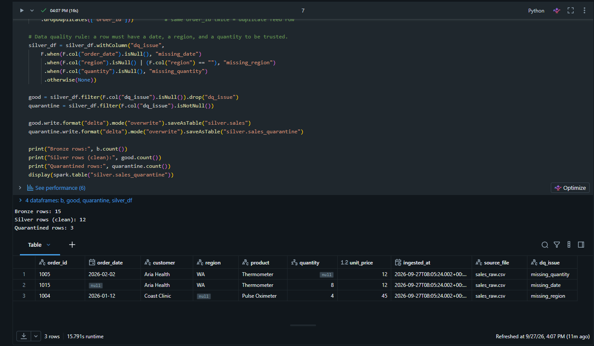
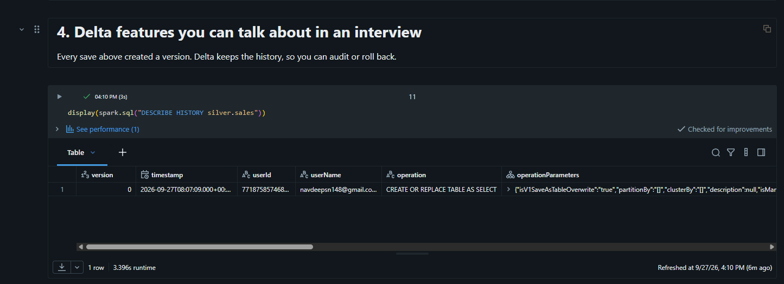
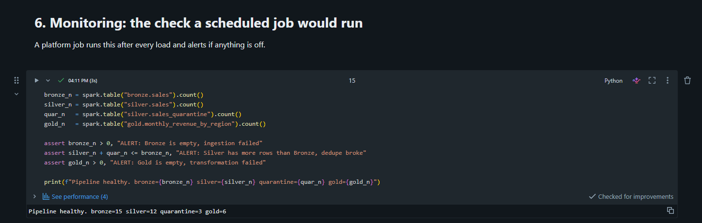

# Azure Databricks Lakehouse: Bronze / Silver / Gold

A small, complete medallion-architecture pipeline built on Databricks to mirror the
enterprise data platform pattern used on Azure: raw data lands in Bronze untouched,
Silver cleans and validates it, Gold serves business-ready aggregates. All layers are
Delta tables with full version history.

## What it does
- **Bronze** `bronze.sales`: raw CSV landed as-is with `ingested_at` and `source_file` audit columns.
- **Silver** `silver.sales`: dates parsed from two formats, region standardised, types cast,
  duplicate orders removed. Rows failing data-quality rules go to `silver.sales_quarantine`
  with a `dq_issue` reason instead of being silently dropped.
- **Gold** `gold.monthly_revenue_by_region`: revenue, units, and order counts by month and region.
- **Governance**: schema-level `GRANT` on Gold (Unity Catalog).
- **Monitoring**: post-load row-count assertions that would raise an alert on a scheduled job.

## Why this shape
On the target platform, Fivetran connectors land source-system data in Bronze on a schedule;
Databricks jobs run Silver and Gold; Power BI reads Gold. Ingestion failures from source
changes surface first as Bronze row-count anomalies or Silver quarantine spikes, which is
where the monitoring cell looks.

## Stack
Databricks (Delta Lake, Unity Catalog), PySpark, Spark SQL. Built on Databricks Free Edition;
on Azure the tables would sit in ADLS Gen2 with no change to the notebook logic.

## Run it
1. Upload `sales_raw.csv` to a Volume and set `RAW_PATH` in the notebook.
2. Run all cells top to bottom.
3. Query `gold.monthly_revenue_by_region`.

## Outputs

Gold table, revenue by month and region:

Silver quarantine, rows failing data-quality rules with reason code:

Delta version history on the Silver table:

Scheduled daily job with failure alerting:

## Author
Navdeep Singh, Perth WA. github.com/navdeep077
